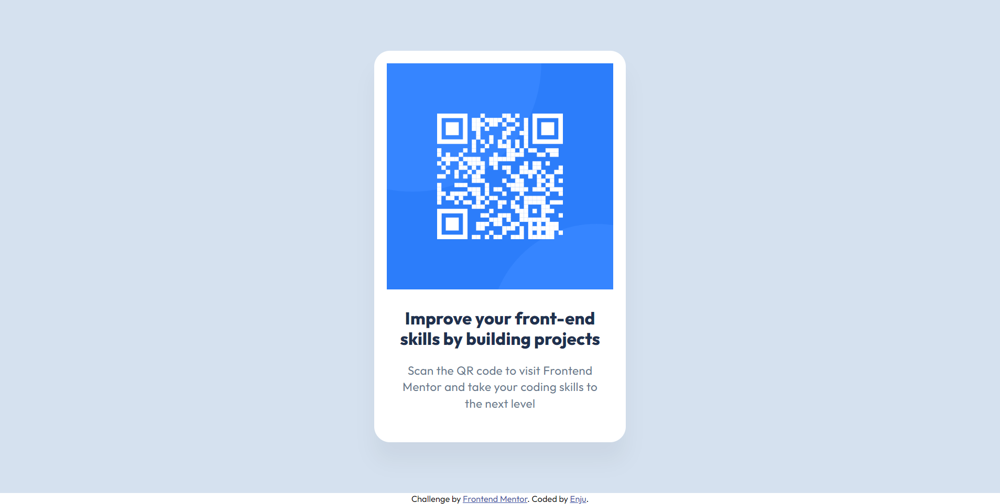

# Frontend Mentor - QR code component solution

This is a solution to the [QR code component challenge on Frontend Mentor](https://www.frontendmentor.io/challenges/qr-code-component-iux_sIO_H). Frontend Mentor challenges help you improve your coding skills by building realistic projects. 

## Table of contents

- [Frontend Mentor - QR code component solution](#frontend-mentor---qr-code-component-solution)
  - [Table of contents](#table-of-contents)
  - [Overview](#overview)
    - [Screenshot](#screenshot)
    - [Links](#links)
  - [My process](#my-process)
    - [Built with](#built-with)
    - [What I learned](#what-i-learned)
  - [Author](#author)
  - [Acknowledgments](#acknowledgments)

**Note: Delete this note and update the table of contents based on what sections you keep.**

## Overview

### Screenshot



### Links

- Solution URL: [Add solution URL here](https://your-solution-url.com)
- Live Site URL: [Add live site URL here](https://your-live-site-url.com)

## My process

### Built with

- Semantic HTML5 markup
- CSS custom properties
- Flexbox
- Desktop-first workflow

### What I learned
About layout design, I usually divide the page into several sections. For example, in this project, I divided the page into two parts: `qr-code-container` and `attribute`. Among them, `qr-code-container` is the main section, occupying the larger portion of the layout. Therefore, I often use `flex-grow: 1` to let the main section automatically fill the remaining space without manually setting its height.

```html
<main>
  <div class="qr-code-container">

  </div>
  <div class="attribution">

  </div>
</main>
```
```css
main {
  display: flex;
  flex-direction: column;
  width: 100vw;
  height: 100vh;
}

.qr-code-container {
  flex-grow: 1;
  background-color: #d5e1ef;
  display: flex;
  justify-content: center;
  align-items: center;
}
```
## Author

- Website - [QR-code by Enju](https://www.your-site.com)

## Acknowledgments

Thanks to [Frontend Mentor](https://www.frontendmentor.io) for providing the practice project.

